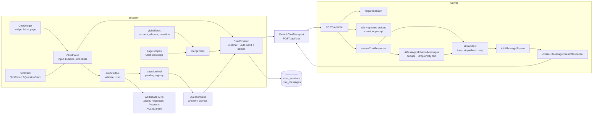

# Chat architecture

How the chat copilot works end to end: streaming, tool execution, the
question tool, and persistence.

## Architecture



## One turn, end to end

```mermaid
sequenceDiagram
    autonumber
    participant U as User
    participant P as ChatPanel
    participant C as ChatProvider (useChat)
    participant T as Transport
    participant A as POST /api/chat
    participant S as streamChatResponse
    participant M as streamText + model
    participant D as DB (sessions)

    U->>P: type message + Enter
    P->>C: sendMessage(text) → input cleared
    C->>T: POST messages + sessionId + merged tool defs
    Note over A: auth → role policies → custom prompt
    A->>S: streamChatResponse(context, messages)
    S->>S: uiMessagesToModelMessages (dedupe, drop empty text)
    S->>M: streamText(model, toolChoice auto, 1 step)
    M-->>S: text deltas + tool calls
    S-->>T: createUIMessageStreamResponse (SSE)
    T-->>C: streamed UI message chunks
    C-->>P: render (sanitize + dedupe parts)
    P->>P: scan tool parts in input-available state
    alt approval: always
        P-->>U: approve / deny card
        U->>P: approve/deny
    else question tool
        P->>P: pending registry + QuestionCard
        U->>P: answer / dismiss
        Note over P: single-select submits immediately;<br/>multi/custom step through
    else auto tool
        P->>P: executeTool (zod validate + run client-side)
        Note over P: form-fill tools may apply to page form
    end
    P->>C: addToolOutput(output / error)
    C->>C: last assistant message complete with tool calls?
    C-->>T: yes → auto-send next request (loop)
    C-->>D: onFinish → save messages (dedupe + sanitize)
    Note over D: first save also generates session title
```

## Key mechanics

- **Tool split.** Global tools (`account_whoami`, `question`) are always
  available; page-scoped tools (`users_*`, `*_form_fill`) are registered per
  page via `ChatToolScope`. `mergeTools` combines them for each request.
- **Definitions to the model, execution in the browser.** Only serialized tool
  definitions travel to the model. `execute` runs client-side, so workspace
  APIs are called from the browser under the caller's own ACL grants.
- **Question tool.** The one tool that blocks its own execution: `execute`
  registers a pending deferred keyed by `toolCallId`, the card renders, and
  answer/dismiss settles it. The `addToolOutput → auto-send` loop then
  continues the turn with the answers in hand.
- **Sanitization.** Before render, send, persist, and model conversion, parts
  are deduped by `toolCallId` and empty text parts are dropped so stale
  duplicates and blank bubbles never reach the UI, the DB, or the model.
- **Persistence.** `chat_sessions` / `chat_messages` are owned per user; the
  first save seeds the session title.
